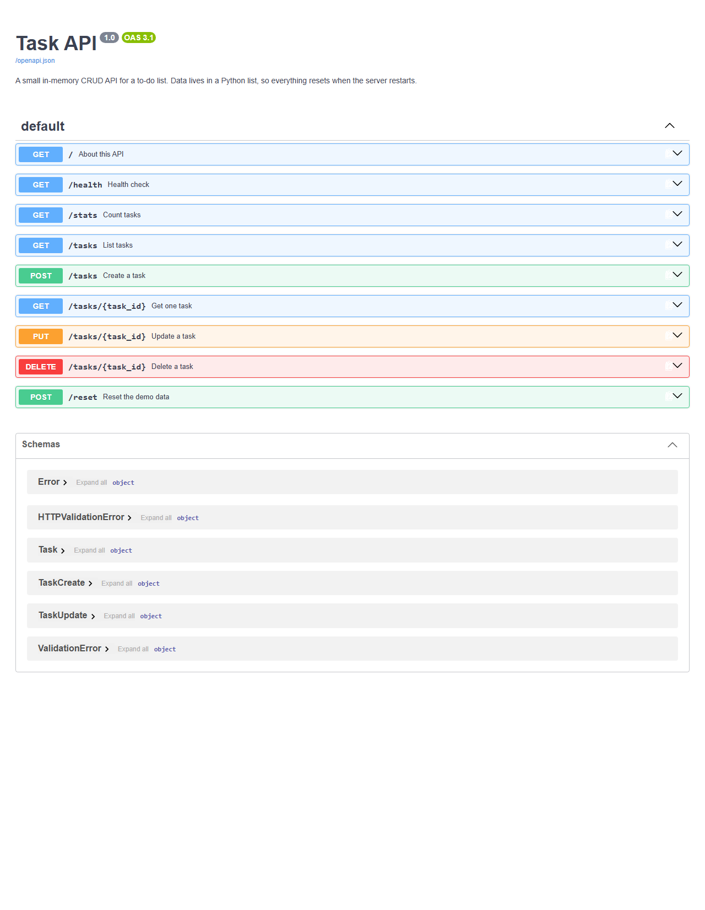

# Task API

A small to-do list API built with **Python + FastAPI**. You can create, read, update and delete tasks — the four CRUD operations — and try every endpoint in the browser through Swagger UI.

There is no database: tasks live in a Python list in memory, so they reset every time the server restarts (see [The mortality experiment](#the-mortality-experiment)).

## Run it

You need Python 3.10 or newer.

```bash
git clone https://github.com/heisenburgerrr1/Crud-api-study.git
cd Crud-api-study
python -m venv venv
```

Activate the virtual environment:

- Windows (PowerShell): `venv\Scripts\Activate.ps1`
- macOS / Linux: `source venv/bin/activate`

Install the packages and start the server:

```bash
pip install -r requirements.txt
uvicorn main:app --reload
```

The API is now running at <http://localhost:8000>, and the interactive docs are at <http://localhost:8000/docs>.

## Endpoints

| Method   | Path          | What it does                            | Success | Errors                  |
| -------- | ------------- | --------------------------------------- | ------- | ----------------------- |
| `GET`    | `/`           | Name, version and list of endpoints     | 200     |                         |
| `GET`    | `/health`     | Health check, returns `{"status":"ok"}` | 200     |                         |
| `GET`    | `/tasks`      | List all tasks                          | 200     |                         |
| `GET`    | `/tasks/{id}` | Get one task                            | 200     | 404 unknown id          |
| `POST`   | `/tasks`      | Create a task from `{"title": "..."}`   | 201     | 400 missing/empty title |
| `PUT`    | `/tasks/{id}` | Change `title` and/or `done`            | 200     | 400 bad body, 404       |
| `DELETE` | `/tasks/{id}` | Delete a task (empty body)              | 204     | 404 unknown id          |
| `GET`    | `/stats`      | Count total, done and open tasks        | 200     |                         |
| `POST`   | `/reset`      | Put the 3 example tasks back            | 200     |                         |

Every error comes back as JSON with an `error` message, for example `{"error": "Task 99 not found"}`.

A task looks like this:

```json
{ "id": 1, "title": "Buy milk", "done": false }
```

### Query parameters on `GET /tasks`

| Parameter | Example                      | Effect                                      |
| --------- | ---------------------------- | ------------------------------------------- |
| `done`    | `/tasks?done=true`           | Only finished (or only open) tasks          |
| `search`  | `/tasks?search=milk`         | Only tasks whose title contains the word    |
| `limit`   | `/tasks?limit=2`             | Return at most this many tasks              |
| `offset`  | `/tasks?limit=2&offset=2`    | Skip this many tasks first (page 2 of 2)    |

They can be combined, e.g. `/tasks?done=false&search=buy&limit=5`.

**Why paginate?** Real APIs never return "everything". A list with a million rows would be slow to build, slow to send and would crash the phone trying to show it. With `limit` and `offset` the client asks for one page at a time and the server only does the work that is actually needed.

## Example: the full CRUD cycle with `curl -i`

Create a task:

```
$ curl -i -X POST http://localhost:8000/tasks -H "Content-Type: application/json" -d '{"title":"Buy milk"}'
HTTP/1.1 201 Created
date: Tue, 15 Sep 2026 06:14:13 GMT
server: uvicorn
content-length: 40
content-type: application/json

{"id":4,"title":"Buy milk","done":false}
```

Rename it, then mark it done:

```
$ curl -i -X PUT http://localhost:8000/tasks/4 -H "Content-Type: application/json" -d '{"title":"Buy oat milk"}'
HTTP/1.1 200 OK
content-type: application/json

{"id":4,"title":"Buy oat milk","done":false}

$ curl -i -X PUT http://localhost:8000/tasks/4 -H "Content-Type: application/json" -d '{"done":true}'
HTTP/1.1 200 OK
content-type: application/json

{"id":4,"title":"Buy oat milk","done":true}
```

Delete it, then try to delete it again:

```
$ curl -i -X DELETE http://localhost:8000/tasks/4
HTTP/1.1 204 No Content

$ curl -i -X DELETE http://localhost:8000/tasks/4
HTTP/1.1 404 Not Found
content-type: application/json

{"error":"Task 4 not found"}
```

Send an empty body:

```
$ curl -i -X POST http://localhost:8000/tasks -H "Content-Type: application/json" -d '{}'
HTTP/1.1 400 Bad Request
content-type: application/json

{"error":"Title is required"}
```

> On Windows PowerShell, use `curl.exe` instead of `curl`, and write the body as `-d '{\"title\":\"Buy milk\"}'`.

## Swagger UI

FastAPI builds the interactive documentation from the code. Open <http://localhost:8000/docs>, pick an endpoint, click **Try it out**, then **Execute** to send a real request.



## The mortality experiment

I created two tasks ("Remember me" and "Me too"), so `GET /stats` showed 5 tasks. Then I stopped the server and started it again, and `GET /tasks` showed only the 3 example tasks — my two new tasks were gone:

```
before restart: {"total":5,"done":1,"open":4}
after restart:  {"total":3,"done":1,"open":2}
```

This happens because the tasks only live in a Python list in the server's memory (RAM). When the process stops, that memory is thrown away, and on start-up the code builds the same 3 example tasks again — to keep data across restarts, it has to be saved somewhere outside the process, like a file or a database.
