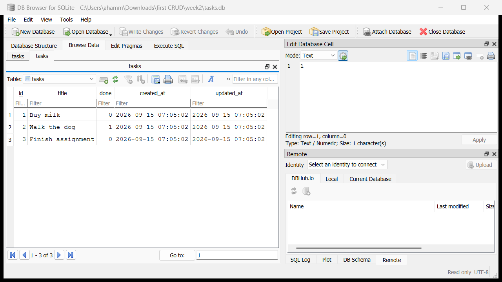

# Task API · Week 2 — now backed by SQLite

**W3 · A2 — Connecting your CRUD to the database.** This is the same to-do list API as [week1](../week1), with one change underneath: tasks are no longer kept in a Python list, they are stored in a **SQLite** database file called `tasks.db`. The endpoints, request bodies and responses are exactly the same as before — but now the data survives a server restart.

```
Assignment 1:  Client -> API -> a list in memory
This one:      Client -> API -> SQLite database (tasks.db)
```

## Run it

You need Python 3.10 or newer. SQLite is built into Python, so there is no database to install.

```bash
git clone https://github.com/heisenburgerrr1/Crud-api-study.git
cd Crud-api-study/week2
python -m venv venv
```

Activate the virtual environment:

- Windows (PowerShell): `venv\Scripts\Activate.ps1`
- macOS / Linux: `source venv/bin/activate`

Install the packages, then start the server with one command:

```bash
pip install -r requirements.txt
uvicorn main:app --reload
```

On the very first start the app creates `tasks.db`, builds the `tasks` table and adds 3 example tasks — no manual database setup. The API runs at <http://localhost:8000> and Swagger UI at <http://localhost:8000/docs>.

## Why SQLite

- **One file.** The whole database is `tasks.db`. You can open it, copy it or delete it like any other file.
- **Zero setup.** It ships with Python (`import sqlite3`). There is no database server to install, start or log in to.
- **Survives restarts.** The data is written to disk, so stopping the server no longer wipes it — the exact problem from week 1.
- **Enough for this app.** If lots of users were writing at the same moment you would switch to a server database such as PostgreSQL — and because the API doesn't change, only the storage code would have to.

## Where the database lives

- `week2/tasks.db`, next to `main.py`. The path is built from where `main.py` is, so the file lands there whichever folder you start the server from.
- It is **created automatically** on the first start.
- It is **git-ignored** (see `.gitignore` at the repo root), so every clone starts fresh with the 3 example tasks and nobody's test data ends up on GitHub.
- To start over: stop the server, delete `tasks.db` and start it again — or call `POST /reset`.

### The table

| Column       | Type                         | Notes                                    |
| ------------ | ---------------------------- | ---------------------------------------- |
| `id`         | `INTEGER PRIMARY KEY`        | SQLite hands out the next id             |
| `title`      | `TEXT NOT NULL`              |                                          |
| `done`       | `BOOLEAN NOT NULL DEFAULT 0` | stored as `0` / `1`                      |
| `created_at` | `TEXT`                       | UTC, set when the task is created        |
| `updated_at` | `TEXT`                       | UTC, set on create and on every update   |

There is also an index, `idx_tasks_done`, on the `done` column.

Every start runs `init_db()`: `CREATE TABLE IF NOT EXISTS`, add any missing columns, create the index, and insert the 3 example tasks **only if the table is empty** — so restarting never duplicates them.

## Endpoints — unchanged from week 1

| Method   | Path          | SQL behind it                                                         | Success | Errors   |
| -------- | ------------- | --------------------------------------------------------------------- | ------- | -------- |
| `GET`    | `/tasks`      | `SELECT * FROM tasks ORDER BY id`                                     | 200     |          |
| `GET`    | `/tasks/{id}` | `SELECT * FROM tasks WHERE id = ?`                                    | 200     | 404      |
| `POST`   | `/tasks`      | `INSERT INTO tasks (title, done, created_at, updated_at) VALUES (?, ?, …)` | 201 | 400      |
| `PUT`    | `/tasks/{id}` | `UPDATE tasks SET title = ?, done = ?, updated_at = … WHERE id = ?`   | 200     | 400, 404 |
| `DELETE` | `/tasks/{id}` | `DELETE FROM tasks WHERE id = ?`                                      | 204     | 404      |
| `GET`    | `/stats`      | `SELECT COUNT(*) FROM tasks` (and `… WHERE done = 1`)                 | 200     |          |
| `POST`   | `/reset`      | `DELETE FROM tasks`, then the 3 example `INSERT`s, in one transaction | 200     |          |
| `GET`    | `/`, `/health`| no SQL                                                                | 200     |          |

Every error is JSON with an `error` message, word for word as in week 1 — for example `{"error": "Task 99 not found"}`.

Every value that comes from a request goes into the SQL through a `?` placeholder (a **parameterized query**), never pasted into the SQL text. So a title like `x'); DROP TABLE tasks; --` is simply saved as that text and the table is fine — one of the checks this project runs.

The timestamps are stored in the table (you can see them in DB Browser) but not returned by the API, so the responses keep exactly the same shape as in week 1.

### Query parameters on `GET /tasks` — done in SQL, not in a loop

| Parameter        | Example              | SQL                                                                  |
| ---------------- | -------------------- | -------------------------------------------------------------------- |
| `done`           | `?done=true`         | `WHERE done = ?`                                                     |
| `search`         | `?search=milk`       | `WHERE title LIKE ?` with `%milk%` — ignores case; `%` and `_` typed in a search are matched literally |
| `sort`           | `?sort=title`        | `ORDER BY title` (the default is `ORDER BY id`)                      |
| `limit`/`offset` | `?limit=2&offset=2`  | `LIMIT ? OFFSET ?`                                                   |

They combine, e.g. `/tasks?done=false&search=buy&sort=title`. Bad values such as `?limit=-1` or `?sort=bogus` return `400` with an error message.

## Example: `curl -i`

A full cycle, recorded on a fresh clone of this repo right after the first start (the server is restarted halfway through to show the data survives):

```
$ curl -i http://localhost:8000/tasks
HTTP/1.1 200 OK
date: Tue, 15 Sep 2026 07:08:40 GMT
server: uvicorn
content-length: 136
content-type: application/json

[{"id":1,"title":"Buy milk","done":false},{"id":2,"title":"Walk the dog","done":true},{"id":3,"title":"Finish assignment","done":false}]

$ curl -i -X POST http://localhost:8000/tasks -H "Content-Type: application/json" -d '{"title":"Water the plants"}'
HTTP/1.1 201 Created
date: Tue, 15 Sep 2026 07:08:40 GMT
server: uvicorn
content-length: 48
content-type: application/json

{"id":4,"title":"Water the plants","done":false}

# ...server stopped and started again...

$ curl -i http://localhost:8000/tasks/4
HTTP/1.1 200 OK
date: Tue, 15 Sep 2026 07:08:44 GMT
server: uvicorn
content-length: 48
content-type: application/json

{"id":4,"title":"Water the plants","done":false}

$ curl -i -X PUT http://localhost:8000/tasks/4 -H "Content-Type: application/json" -d '{"done":true}'
HTTP/1.1 200 OK
date: Tue, 15 Sep 2026 07:08:44 GMT
server: uvicorn
content-length: 47
content-type: application/json

{"id":4,"title":"Water the plants","done":true}

$ curl -i -X DELETE http://localhost:8000/tasks/4
HTTP/1.1 204 No Content
date: Tue, 15 Sep 2026 07:08:44 GMT
server: uvicorn
content-type: application/json

$ curl -i http://localhost:8000/tasks/4
HTTP/1.1 404 Not Found
date: Tue, 15 Sep 2026 07:08:45 GMT
server: uvicorn
content-length: 28
content-type: application/json

{"error":"Task 4 not found"}

$ curl -i -X POST http://localhost:8000/tasks -H "Content-Type: application/json" -d '{}'
HTTP/1.1 400 Bad Request
date: Tue, 15 Sep 2026 07:08:45 GMT
server: uvicorn
content-length: 29
content-type: application/json

{"error":"Title is required"}
```

## Stage 4 — SQL by hand



One query I ran against `tasks.db`:

```sql
SELECT * FROM tasks WHERE done = 1;
```

It returned one row, `2 | Walk the dog | 1` — the only example task that starts out finished.

Then `UPDATE tasks SET done = 1;` made `GET /tasks` show every task with `"done": true`, and `DELETE FROM tasks WHERE done = 1;` made it return `[]` — straight away, with no restart, because the API and the viewer read the very same file. There is no syncing; there is one source of truth. One surprise: after that delete the table was empty, so on the next start the seed rule kicked in and the 3 example tasks came back.

All five queries from the assignment, with their real results, are in [`explore.sql`](explore.sql).

## Persistence, proven

From the Stage 2 checkpoint — two tasks created, the server stopped and started again, and both were still there:

```
POST /tasks {"title":"Stage 2 task A"}  -> 201 {"id":4,"title":"Stage 2 task A","done":false}
POST /tasks {"title":"Stage 2 task B"}  -> 201
--- server stopped and started again ---
GET /tasks -> [{"id":1,…},{"id":2,…},{"id":3,…},{"id":4,"title":"Stage 2 task A","done":false},{"id":5,"title":"Stage 2 task B","done":false}]
```

In Stage 3 the server was restarted between marking a task done and deleting it — after the restart it was still `"done": true`.

## Proving the API didn't change

[`api_check.py`](api_check.py) runs 18 checks of the week 1 contract — every endpoint, every status code (200 / 201 / 204 / 400 / 404), the error JSON and the exact shape of a task. It only uses the Python standard library. With a server running:

```bash
python api_check.py                         # checks http://localhost:8000
python api_check.py http://localhost:8001   # or any other server
```

| Server  | Storage          | Result          |
| ------- | ---------------- | --------------- |
| `week1` | Python list      | 18 / 18 passed  |
| `week2` | SQLite `tasks.db`| 18 / 18 passed  |

Why this is the proof: the script only sees what a client sees — URLs, status codes and JSON. It knows nothing about lists or databases. The exact same checks pass against both versions, so from the outside they cannot be told apart. The storage really is just an implementation detail hidden behind the API.

## Index

```sql
CREATE INDEX IF NOT EXISTS idx_tasks_done ON tasks (done);
```

An index is a sorted lookup list for a column, so `WHERE done = ?` can jump straight to the matching rows instead of reading every row in the table. SQLite's own query plan confirms it is used:

```
EXPLAIN QUERY PLAN SELECT * FROM tasks WHERE done = ?
SEARCH tasks USING INDEX idx_tasks_done (done=?)
```

The index is on `done` rather than `title` because search uses `LIKE '%milk%'`, and a pattern that starts with `%` can't use an index.

## Transaction

Seeding the 3 example tasks runs as one transaction (`connect()` wraps the work in `with conn:`, which commits at the end or rolls everything back on an error), and so does `POST /reset`. That matters because if the server crashed after inserting only 1 of the 3 tasks, the table would no longer be empty, so the seed would never run again to fix it — with a transaction you get all 3 or none.

## Timestamps — changing the table's shape

Adding `created_at` and `updated_at` was easy for a brand-new database, but my existing `tasks.db` already had a `tasks` table, and `CREATE TABLE IF NOT EXISTS` simply skips a table that exists — so the new columns would never have appeared and every `INSERT` that names them would fail. The fix was a hand-written check (`PRAGMA table_info`, then `ALTER TABLE … ADD COLUMN` for anything missing), and the rows that already existed ended up with empty timestamps, because nobody had recorded when they were made; changing a table's shape once real data is in it is fiddly and easy to get wrong, which is exactly why migrations exist.

## Swagger UI

<http://localhost:8000/docs> works exactly as in week 1 — FastAPI builds it from the same code, and nothing about the endpoints changed.

## Files

| File                   | What it is                                           |
| ---------------------- | ---------------------------------------------------- |
| `main.py`              | The API and its SQLite storage code                  |
| `api_check.py`         | The week 1 contract check (18 checks)                |
| `explore.sql`          | The Stage 4 queries with their real results          |
| `docs/db-browser.png`  | Screenshot of `tasks.db` open in DB Browser          |
| `requirements.txt`     | Python packages (SQLite needs none)                  |
| `tasks.db`             | Created on first start; git-ignored                  |
